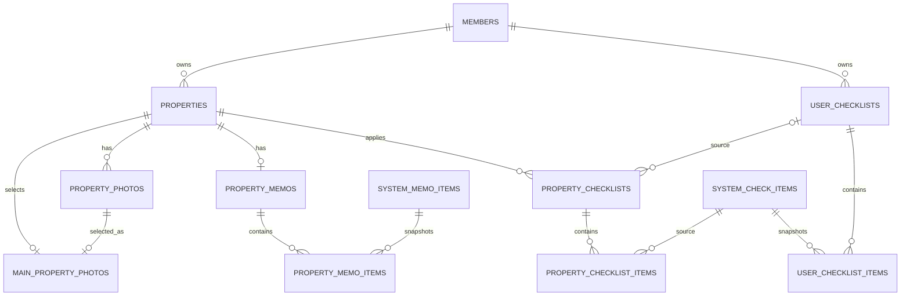

# MVP2 데이터 모델

- 상태: 구현 완료 v1
- 문서 성격: 파생
- 대조 대상: [MVP2 기능 명세](../../../docs/product/specs/README.md), [`001-schema.sql`](../../src/main/resources/db/init/001-schema.sql)

## 원칙

- 제품 정책의 정본은 기능 명세와 [결정 대장](../../../docs/product/decisions/README.md)이다.
- 이 문서는 `001-schema.sql`에서 파생되는 설명 문서다.
- Flyway를 사용하지 않으므로 스키마 변경 뒤 로컬 MySQL volume을 초기화한다.
- 주변 시설 응답은 저장하지 않고 Kakao Local API 또는 데모 adapter에서 그때 조회한다.

## ERD

## MVP2의 `properties`

| 컬럼 | 타입 | 제약 | 설명 |
| --- | --- | --- | --- |
| `id` | BIGINT | PK, AUTO_INCREMENT | 매물 ID |
| `member_id` | BIGINT | FK, NOT NULL | 소유 회원 |
| `name` | VARCHAR(50) | NOT NULL | 애플리케이션 제한 30자 |
| `deposit_amount` | BIGINT | NOT NULL, DEFAULT 0 | 원 단위 보증금 |
| `monthly_rent_amount` | BIGINT | NOT NULL, DEFAULT 0 | 원 단위 월세 |
| `discovery_source` | VARCHAR(500) | NOT NULL, DEFAULT '' | 링크·중개사 연락처 등 |
| `road_address` | VARCHAR(255) | NULL | 대표 도로명 주소 |
| `jibun_address` | VARCHAR(255) | NULL | 지번 주소 |
| `latitude` | DECIMAL(10,7) | NULL | WGS84 위도 |
| `longitude` | DECIMAL(11,7) | NULL | WGS84 경도 |
| `created_at` | DATETIME(6) | NOT NULL | UTC 생성 시각 |
| `updated_at` | DATETIME(6) | NOT NULL | 기본 정보 수정 시각 |
| `last_activity_at` | DATETIME(6) | NOT NULL | 목록 최신순 기준 |

### 제약과 인덱스

- 위도와 경도는 둘 다 NULL이거나 둘 다 값이어야 한다.
- `CHECK(latitude BETWEEN -90 AND 90)`, `CHECK(longitude BETWEEN -180 AND 180)`를 둔다.
- `(member_id, last_activity_at DESC, id DESC)` 인덱스를 둔다.
- `(id, member_id)` UNIQUE는 사진 소유자 복합 FK를 위해 유지한다.
- 주소가 없는 MVP1 행은 주소와 좌표를 NULL로 둔다.

## 대표 사진 정합성

`main_property_photos.property_id`를 UNIQUE로 만들어 매물당 대표 사진을 하나만 허용한다. 대표 사진 행의 사진이 같은 매물 소속임을 서비스와 복합 FK로 함께 보장한다.

- 첫 사진 업로드: 대표 관계가 없으면 삽입
- 대표 변경: 매물 행 잠금 뒤 upsert 또는 delete·insert
- 대표 삭제: 남은 `created_at, id` 첫 사진으로 교체
- 마지막 사진 삭제: 대표 관계 제거

## 삭제 정책

| 부모 | 자식 | 정책 |
| --- | --- | --- |
| `properties` | 사진·대표 사진·메모·매물 체크리스트 | `ON DELETE CASCADE` |
| `property_memos` | 메모 항목 | `ON DELETE CASCADE` |
| `user_checklists` | 사용자 항목 | `ON DELETE CASCADE` |
| `user_checklists` | 매물 체크리스트 출처 | `ON DELETE SET NULL` |
| `property_checklists` | 매물 체크 항목 | `ON DELETE CASCADE` |

객체 저장소는 FK가 처리할 수 없으므로 매물 삭제 전에 storage key 목록을 확보하고 객체를 삭제한다. 일부 객체 삭제 실패는 재시도 가능한 실패로 응답하고 DB 삭제를 커밋하지 않는다.

## 최근 활동 갱신

다음 성공 트랜잭션에서 `properties.last_activity_at`을 같은 DB 트랜잭션으로 갱신한다.

- 매물 생성·수정
- 사진 업로드·삭제·대표 변경
- 메모 저장
- 체크리스트 적용·교체
- 체크 상태·항목 메모 저장

## 유지하는 스냅샷

- `user_checklist_items`는 단계·유형·질문·순서를 복사한다.
- `property_checklist_items`는 시스템 ID·질문·순서·상태·메모를 복사한다.
- `property_memo_items`는 시스템 ID·라벨·순서를 복사한다.
- 원본의 변경·비활성화는 기존 스냅샷을 자동 변경하지 않는다.

## 초기화와 시드

- `001-schema.sql`: 전체 스키마 한 벌
- `002-seed.sql`: 시스템 메모 항목, 세 단계의 시스템 체크 항목, 데모에 필요한 최소 기준 데이터
- 데모 회원·매물·진행 결과는 `demo` 프로필 전용 초기화로 분리해 운영 시드에 섞지 않는다.
